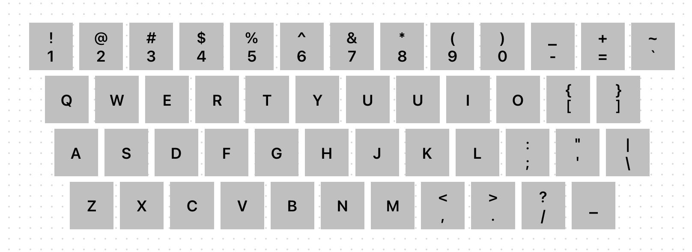
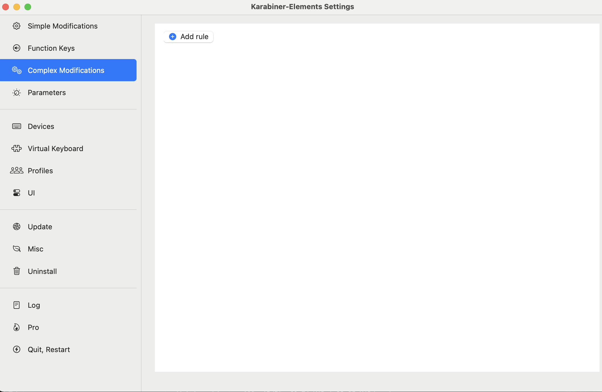
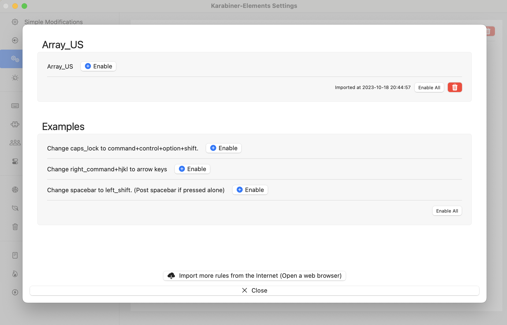

# Macbook_array_US
このjsonのコードを用いれば、JIS配列のキーボードがまるでUS配列(多少改変あり)になったかのように扱うことができます。

**変更後のキー配列**


**セット方法**
1. 以下のリンクからKarabiner-Elementsのダウンロードを行ってください。
   また、指示に従ってセットアップを完了させてください。
   https://karabiner-elements.pqrs.org/

2. 以下のディレクトリにこのレポジトリ内のarray_US.jsonをコピーしてください。
   ```
   /Users/ユーザ名/.config/karabiner/assets/complex_modifications
   ```

3. Karabiner-Elementsを開き、Complex Modificationsを選択してください。
   選択するとAdd ruleというボタンがあるのでクリックしてください。

   

4. Array_USという選択肢を見つけられるはずです。横の+Enableを押せば完了です！

   
